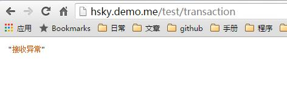
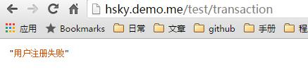
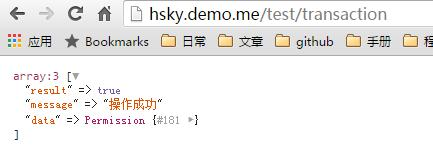
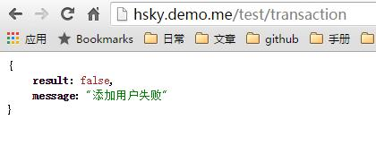

# Laravel DB 事务

1. 自动事务  
	[1. 基本使用transaction](#1.1)  
	[2. 增加处理transaction中异常](#1.2)  
	[3. 手动设置提示信息](#1.3)  
	[4. 获取DB::transaction中返回值](#1.4)  
1. 手动事务		
	[1. 获取DB::transaction中返回值](#2.1)

> Laravel有2中开启事务的方法
> ######第一种 自动事务
> * DB::transaction() 传递闭包
> ######第二种 手动事务
> * DB::beginTransaction() 开启
> * DB::rollback() 回滚
> * DB::commit() 提交

### DB::transaction 回滚,需要抛出异常

<span id="1.1"></span>
#### 示例一  基本使用transaction
> - 添加成功，数据多两条数据	
> - 添加失败，两条数据都不会添加成功,laravel会自动回滚, 页面会获取laravel抛出的异常	
> - 显然这样的方式，对于获取错误，或者信息提示都是非常不方便和不合理的, 看示例二
-----

```php
DB::transaction(function(){
	/*创建用户*/
	factory(\App\User::class)->create();

	/*创建权限*/
	factory(\App\Models\Permission::class)->create();
});
```

<span id="1.2"></span>
#### 示例二 增加处理transaction中异常
```php
try {
	DB::transaction(function(){
		factory(\App\User::class)->create();
		
		/*为了看到效果，此处手动抛出异常*/
		throw new \Exception('接收异常');
		
		factory(\App\Models\Permission::class)->create();
	});
} catch (\Exception $e) {
	dd($e->getMessage());
}
```


<span id="1.3"></span>
#### 示例三 手动设置提示信息
```php
$returnData = [
	'result' => false,
	'message' => '信息错误'
];

try {
	DB::transaction(function(){
		factory(\App\User::class)->create();

		$user = [
			'result' => false,
			'message' => '用户注册失败',
		];

		if(!$user['result']){
    		throw new \Exception($user['message']);
		}

		factory(\App\Models\Permission::class)->create();
	});
} catch (\Exception $e) {
	dd($e->getMessage());
}

$returnData =  array_merge($returnData, [
	'result' => true,
	'message' => '操作成功',
]);

dd($returnData);
```


<span id="1.4"></span>
#### 示例四 获取DB::transaction中返回值
```php
$returnData = [
	'result' => false,
	'message' => '信息错误'
];

$exception = '';

try {
	$exception = DB::transaction(function(){
		factory(\App\User::class)->create();

		$permission = factory(\App\Models\Permission::class)->create();
		return $permission;
	});
} catch (\Exception $e) {
	dd($e->getMessage());
}

$returnData =  array_merge($returnData, [
	'result' => true,
	'message' => '操作成功',
	'data' => $exception,
]);

dd($returnData);
```


<span id="2.1"></span>
### 1. 使用手动开启事务

```php
$returnData = [
	'result' => false,
	'message' => '信息错误'
];

$exception = '';

DB::beginTransaction();

/*添加用户*/
factory(\App\User::class)->create();

$user = [
	'result' => false,
	'message' => '添加用户失败'
];

if(!$user['result']){
	DB::rollback();
	return array_merge($returnData, $user);
}

factory(\App\Models\Permission::class)->create();

DB::commit();

$returnData =  array_merge($returnData, [
	'result' => true,
	'message' => '操作成功',
]);

dd($returnData);
```
