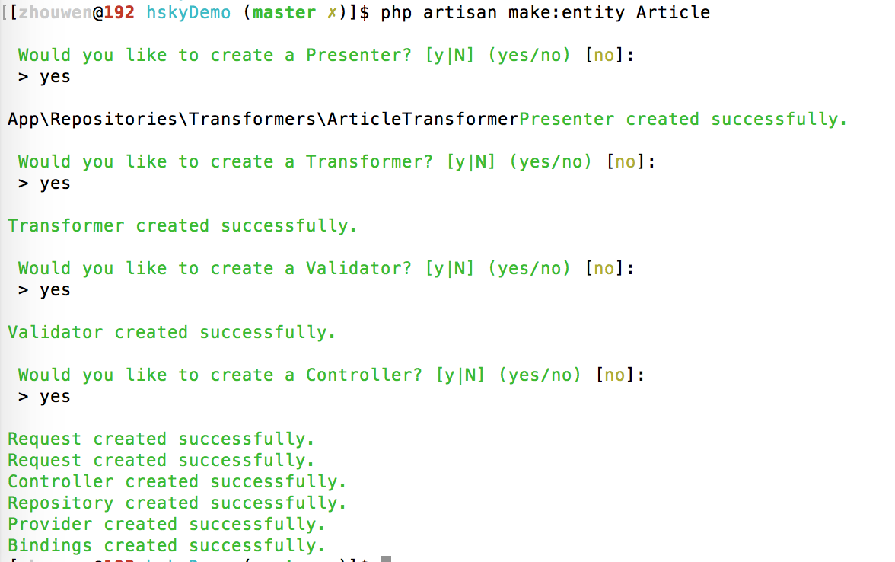

# Laravel中Repository模式浅见

`在laravel强大的orm前提，为什么还要去考虑repository模式，是否多次一举？`
******

> 在讨论此问题之前，先简单的回顾一下Orm
> 既然先要讨论一下orm，那么问题来了，那什么是orm， orm到底又能干什么呢

## 什么是Orm -- Object Relational Mapping
翻开`Eloquent/Model` 这个文件。整整3596行。或者第一眼就会吓跑很多想要了解他的人🙃
那么这个文件到底有什么，又或者它能处理什么？

### Laravel Orm有什么
1. Domain Model (Data Model 和 领域逻辑)
2. Row Data Gateway（例如save，delete等数据持久化操作）
3. Table Data Gateway（各种find方法）
4. Factory (新建model)
### 使用感觉
> 那么如果强大，甚至可以说是无所不能的Model，是不是使用起来也是如此的得心应手呢？
> 但是事情不像期待的那么美好，或许是大西洋那里的蝴蝶不小心扇了下翅膀。
那么需求如下：
1. 需求1: 我要获取所有的用户列表， 一听这个需求，你就说，这个太简单了。orm里面有`all` 方法，我可以直接完成
2. 需求2: 我要获取用户名是`hsky`的用户列表。这时候你一听，这也很简单，我只要where一样，照样分分钟就搞定了。直接用`where(name, 'hsky')`就完事了。
> 你的真的以为事情就这样愉快的结束了。那我也只能🙃🙃🙃下了。
3. 新需求又来了，变成了。我需要一个状态是open的，用户名是hsky的用户列表，这时候，有巴拉巴拉的敲了几分钟，功能又好了，开开心心的完工，完成如下`where(name, 'hsky')->where('status', 1)`,
> 到这里先整理一下，all是orm自带了,不需要我们自己写，那么需求2和需求3，有好几种处理方法。第一种，一个方法获取一种数据，恩，的确，很简单明了，也方便维护，还是可重用。第二种，有人说了，我可以并到一起处理，写一个方法，传两个参数就好了，首先因为参数数量不多，完全可以接受，而且又能减少代码，格式也看起来比较整洁，似乎也是很不错的选择。第三种，加入scope元素，等等，方法很多的。那么结果到底如何，我们继续看下去。
4. 需求4：我需要用于手机号是135开头，年龄>18岁的。这时候，该写方法的继续写方法，改加参数的继续加参数。
> 然而我们写过模块的，都知道，有时候有的模块可能仅仅只需要最简单的增删改查，但是有时候有的模块要处理复杂的数据，复杂的业务流程。具体下面详细说。

### 结论：
对于一般的小项目，比如写个单页之类的，的的确确，一个model完全能够搞定所有的事情，什么Repository，什么Contracts，都是一堆渣渣，或者说是多此一举。然而项目都是越来越完善，越做越大，越做越具体的。你势必会觉得，orm越来越吃力，代码越来越不易维护，越来越不想去看第二遍，甚至在想，哎呀，就这样吧。`等我哪天有时间再去重构吧`。最后这个哪一天永远是那么的遥遥无期。最后变成，自己也不愿意去看的烂大街代码。那么有什么能避免这种问题，或者能够解决这种问题呢？


> 进入主题之前，先说段个人感想吧。真人真项目真事情。
> 云平台项目，或许知道的人不多，但是今天不是来说项目是如何如何的复杂，是如何如何难以理解，这些不是今天的主题，一律不讲。我们只讲代码。我依旧记得当初使用了[MVC](MVC浅析)，Model-View-Controller,相信在座的应该都知道MVC是何物，不过还是简单的说明下。当时想着，Model处理数据,Controller处理请求，View处理页面，多么perfect的决定。但是不久的将来就感觉当时的无知。的确mvc是最好的模式，也是最基本的模式，就是流程图中的3中基本图形一般，可以组成各种各样的流程图。言归正传，但是还特别因为怕一个方法太复杂，处理功能越多，出错的概率越多，特地想好的，一个方法获取一种数据，然后结果就是，方法是越来越多，文件是越写越长。功能也是越写越多。最终结果是不是就是越好维护呢。然而事实却是残酷，代码多了，找起来都难，甚至都知道是在这个文件里了。还要找，更不要说去维护，重用了。或许能不错就已经谢天谢地了吧。那么又该如何呢？好了，下面开始进入正题吧！

## MVC浅析
- M:Model(模型)
- V:View(视图)
- C:Controller(控制器)

个人理解：Controller用于接收请求，然后去Model获取数据，再把数据渲染到View，最后把页面呈现给用户。

那么从MVC完成的功能上看，现在MVC已经很好的完成了分离数据和视图操作。

## Repository Pattern
> 没错，就是仓库模式。
> 那么仓库模式要怎么用呢？或许这是问的最多的问题了。

- 介绍
- 包安装
- 接口
- 目录结构
- 实现
- 条件
- presenter
- validator

#### 介绍
概念定义：
A Repository mediates between the domain and data mapping layers, acting like an in-memory domain object collection. Client objects construct query specifications declaratively and submit them to Repository for satisfaction. Objects can be added to and removed from the Repository, as they can from a simple collection of objects, and the mapping code encapsulated by the Repository will carry out the appropriate operations behind the scenes.
仓库在领域逻辑和数据映射出呢过,就像内存领域对象集合。客户对象声明性的构造查询规范并且提交到仓库为了满足情况。客户可以从仓库被添加和移除,因为他们可能来自简单对象集合,并且由仓库封装的映射代码会在幕后执行相当的操作。

那么到底什么仓库模式，本质上来说，仓库能够使我们查询数据的数据源，将数据映射到业务实体并且将业务实体的更改保存到数据源。简单说，仓库顾名思义，就是用来存放东西，取东西的地方，那么在程序中仓库也是一样的。

优点：

* 更容易维护代码
* 减少程序出错
* 减少代码复制
* 业务跟数据分离测试

#### 包安装
```php
"bosnadev/repositories": "0.*"
```
1. 查看接口中提供的方法，进行基本使用
2. 

#### 仓库模式的接口
接口：定义通用操作
仓库中的接口就用来定义仓库的一系列公共的方法，比如常见的有
```php

    public function all($columns = array('*'));

    public function paginate($perPage = 15, $columns = array('*'));

    public function create(array $data);

    public function update(array $data, $id);

    public function delete($id);

    public function find($id, $columns = array('*'));

    public function findBy($field, $value, $columns = array('*'));


#### 目录结构
- Eloquent  -- 具体实现
- Criterias  -- 条件
- Contracts  -- 接口
- Presenters  -- 数据预处理
- Validators  -- 验证
- Exceptions  -- 异常

#### 实现
定义接口，然后在具体实现类中，实现该接口。具体见`demo`

#### 条件
条件也可以说是查询标准。或者上面那个通用的方法仅能满足基本功能。但是还是有许许多多的功能无法得到满足。那么引入条件查询，它不同于scope，因为scope只能定义在一个model中，局限性太大。而Criterai(条件），是适用于所有的Respository

#### presenter 
在仓库模式中，presenter用来对数据的处理，比如说，有个字段是is_success, 那么很多时候想用的时候，可能就需要这个字段就是boolean类型。而presneter就是处理这个的

#### validator 验证
可以分离开创建以及修改

`接下来一个个验证`

#### 使用
1. 创建model
    php artisan make:entity Article




