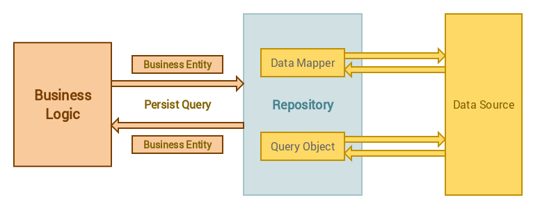

##Using Repository Pattern in Laravel 5   在laravel5中使用仓库模式

These days there is a lot of buzz about software design patterns, and one of the most frequently asked questions is “How can I use some pattern with some technology“.
这些天有许多关于软件设计模式的嗡嗡声，并且其中最常见的问题是"我如何在某些技术中使用某种模式"

 In the case of Laravel and the Repository pattern, I see often questions like “How I can use repository pattern in Laravel 4” or nowadays “..in Laravel 5”.
 如果是在laravel和仓库模式下，我通常看到的问题, 如 "我如何在laravel4中使用仓库模式", 或者如今的"...在laravel5中".

Important thing you must remember is that design patterns do not depend on specific technology, framework or programming language.
你必须要记得的事情是, 设计模式不依赖特定技术，框架或者编程语言.

Contents 内容 
1 Introduction  介绍
2  It’s all about interfaces 一切关于接口
3 Directory structure  目录结构
4 A Repository Implementation 仓库实现
5 Criteria Queries 条件查询
5.1 Creating A New Criteria 创建一个新条件
5.2 Using Criteria In The Controller 在控制器中使用条件
6 Package Installation 安装包
7 Conclusion 讨论 
8 Credits 关于作者

### Introduction 介绍
If you have really understood Repository Pattern then it does not matter what framework or programming language you are going to use. 
如果你真正理解设计模式，那么它跟你正在使用的框架或者编程语言没有关系。
What is important is that you understand the principle behind the Repository pattern. 
理解仓库模式背后的本质才是重要的
Then you can implement it in whatever technology you want. 
然后你可以实现它用你想用的任何技术。
With that in mind, let’s start with the definition of the Repository pattern:
记住这一点之后，让我们开始仓库模式的定义:

A Repository mediates between the domain and data mapping layers, acting like an in-memory domain object collection. 
仓库在领域逻辑和数据映射出呢过,就像内存领域对象集合
Client objects construct query specifications declaratively and submit them to Repository for satisfaction. 
客户对象声明性的构造查询规范并且提交到仓库为了满足情况。
Objects can be added to and removed from the Repository, as they can from a simple collection of objects, and the mapping code encapsulated by the Repository will carry out the appropriate operations behind the scenes.
客户可以从仓库被添加和移除,因为他们可能来自简单对象集合,并且由仓库封装的映射代码会在幕后执行相当的操作。

Repository pattern separates the data access logic and maps it to the business entities in the business logic. 
仓库模式分离了数据访问层并且在业务逻辑层把数据访问层映射到业务实体。
Communication between the data access logic and the business logic  is done through interfaces.
通过接口把数据访问层以及业务层联系起来。



To put it simply, Repository pattern is a kind of container where data access logic is stored. 
简单说，仓库模式就是一种存放数据访问逻辑的容器。
It hides the details of data access logic from business logic. 
它隐藏了来自业务逻辑的数据访问逻辑的详情。
In other words, we allow business logic to access the data object without having knowledge of underlying data access architecture.
话句话说，我们允许也业务逻辑去访问数据对象而不需要了解潜在的数据访问结构。

The separation of data access from business logic have many benefits. 
把数据访问从业务逻辑中分离有很多好处。

Some of them are: 如下所述
1. Centralization of the data access logic makes code easier to maintain
    数据访问逻辑的集中化使维护代码更简单
1. Business and data access logic can be tested separately
    业务和数据访问可以单独测试
1. Reduces duplication of code
    减少复制代码
1. A lower chance for making programming errors
    减少程序出错

### It’s all about interfaces 一切关于接口
Repository pattern is all about interfaces. 
仓库模式都关于接口
An interface acts like a contract which specify what an concrete class must implement. 
一个接口像一个合同那样，说明必须实现一个具体的类
Let’s think a little bit. 
让我们想一点
If we have two data objects Actor and Film, what are common set of operations that can be applied to these two data objects? 
如果我们有2个数据对象，Actor和Film， 什么是可以应用到这两个数据对象的常用操作集？
In most situations we want to have the following operations:
在大多数情况下，我们想要以下的操作：

1. Get all records
    获取所有记录
1. Get paginated set of records
    获取记录集的分页
1. Create a new record
    创建一条新纪录
1. Get record by it’s primary key
    通过主键获取记录
1. Get record by some other attribute
    通过一些属性获取记录
1. Update a record
    更新一条记录
1. Delete a record
    删除一条记录

Can you see now how much duplicated code would we have if we implement this for each data object? 
你能预见如果为每个数据对象实现这些方法会有多少重复代码要写？
Sure, for small projects it’s not a big problem, but for large scale applications it’s a bad news.
当然了，如果是小项目自然不是大问题，如果是大规模的项目就是大事件了。

Now when we have defined common operations, we can create an interface:
现在我们可以创建一个接口来定义通用的操作。

```php
interface RepositoryInterface {

    public function all($columns = array('*'));

    public function paginate($perPage = 15, $columns = array('*'));

    public function create(array $data);

    public function update(array $data, $id);

    public function delete($id);

    public function find($id, $columns = array('*'));

    public function findBy($field, $value, $columns = array('*'));
}
```

### Directory structure 目录结构
Before we continue with creating concrete repository class that will implement this interface, let’s think a bit how we want to organise our code. 
在我们继续创建这个具体的仓库类，让我们想一想怎样组织我们的代码来实现这个接口。
Usually, when  I create something, I like to think component way since I want to be able to reuse that code in other projects. 
通常，当我创建一些东西，我喜欢使用组件方式，因为我想要能够在其他项目中复用这些代码。
My simple directory structure for the repositories component looks like this:
我简单的仓库组件的目录结构就像这样：


But it can be different, for example if component have configuration options, or migrations, etc.
但它可以不同，比如组件可以有配置选项，或者迁移，等等。

Inside  `src`  directory I have three other directories: Contracts, Eloquent and Exceptions. 
在src目录下面，我有3种不同的目录，Contracts， Eloquent 和 Exceptions
As you can see, the folder names are pretty convenient for what we want to put there. 
你可以明白，文件夹的命名对于我们想放什么非常简单
In Contracts folder we put interfaces, or contracts as we call them earlier.
在Contracts文件夹，我们放接口或者合同，就像我们之前说的
Eloquent folder contains abstract and concrete repository class that implements contract. 
Eloquent文件夹包含抽象和实现了合同的具体repository类
In Exceptions folder we put exceptions classes.
在Exceptions文件夹我们存放异常类

Since we are creating a package we need to create  composer.json  file where we define a mapping for namespaces to specific directories, package dependencies and other package metadata. 
既然我们正在创建一个包，我们需要创建一个composer.json文件用来定义命名空间和制定目录的映射，包依赖，和其他包元数据。
Here is the content of  composer.json  for this package:
这里是包中composer.json的内容

`
{
  "name": "bosnadev/repositories",
  "description": "Laravel Repositories",
  "keywords": [
    "laravel",
    "repository",
    "repositories",
    "eloquent",
    "database"
  ],
  "licence": "MIT",
  "authors": [
    {
      "name": "Mirza Pasic",
      "email": "mirza.pasic@edu.fit.ba"
    }
  ],
  "require": {
    "php": ">=5.4.0",
    "illuminate/support": "5.*",
    "illuminate/database": "5.*"
  },
  "autoload": {
    "psr-4": {
      "Bosnadev\\Repositories\\": "src/"
    }
  },
  "autoload-dev": {
    "psr-4": {
      "Bosnadev\\Tests\\Repositories\\": "tests/"
    }
  },
  "extra": {
    "branch-alias": {
      "dev-master": "0.x-dev"
    }
  },
  "minimum-stability": "dev",
  "prefer-stable": true
}
`

As you can see, we mapped namespace Bosnadev\Repository  to the  src  directory. 
如你所见，我们映射命名空间Bosnadev\Repository到src目录。
Another thing, before we start to implement RepositoryInterface, since it is located in the Contracts folder, we need to set correct namespace for it:
另外一件事情，在我们开始实现仓库接口，由于它放在Contracts目录，我们需要设置正确的命名空间：

```php
<?php namespace Bosnadev\Repositories\Contracts;

interface RepositoryInterface {

...

}
```

We are now ready to start with the implementation of this contract.
我们现在可以准备开始合同的实现。

### A Repository Implementation  一个仓库实现
Using repositories enables us to query the data source for the data, map the data to a business entity and persist changes in the business entity to the data source:
使用仓库能够使我们查询数据的数据源，将数据映射到业务实体并且将业务实体的更改保存到数据源。


Of course, each concrete child repository should extend our abstract repository, which implements RepositoryInterface contract. 
当然了，每一个具体的字库都继承了我们的抽象仓库，实现RepositoryInterface合同。
Now, how would you implement this contract? 
显现，我们应该如何实现这个合同？
Take a look at first method. 
让我们看第一个方法。
What can you tell about it just by looking at it?
你能通过看它告诉你什么？

First method in our contract is conveniently named  `all()` .
在我们的合同中第一个方法被合适的命名all. 
It’s duty is to fetch all records for the concrete entity. 
它的任务是为具体实体来获取所有的记录。
It accepts only one parameter  `$columns` which must be an array. 
它接收唯一的参数$columns，并且是一个数组
This parameter is used, as its name suggests, to specify what columns we want to fetch from the data source, and by default  we fetch them all.
这个参数就想它名字期望的那样被使用，来指定哪一列我们想要从数据源中获取，并且默认获取所有。

For specific entity, this method could look like this:
对于指定的实体，这个方法可能就像这样：

```php
public function all($columns = array('*')) {
    return Bosnadev\Models\Actor::get($columns);
}
```

But we want to make it generic, so we can use it wherever we want:
但是我们想让它通用，所以我们可以在我们想要的任何地方使用。

```php
public function all($columns = array('*')) {
    return $this->model->get($columns);
}
```

In this case  `$this->model`  is an instance of  `Bosnadev\Models\Actor` . 
在这个示例中，$this->model是Bosnadev\Models\Actor的实例。
Thus, somewhere in the repository we need to create a new instance of the given model. 
因此，在仓库的某处，我们需要创建一个给定模型的新实例。
Here is one solution how you can implement this:
这里有一种我们可以实现的方案：

```php
<?php namespace Bosnadev\Repositories\Eloquent;

use Bosnadev\Repositories\Contracts\RepositoryInterface;
use Bosnadev\Repositories\Exceptions\RepositoryException;
use Illuminate\Database\Eloquent\Model;
use Illuminate\Container\Container as App;

/**
 * Class Repository
 * @package Bosnadev\Repositories\Eloquent
 */
abstract class Repository implements RepositoryInterface {

    /**
     * @var App
     */
    private $app;

    /**
     * @var
     */
    protected $model;

    /**
     * @param App $app
     * @throws \Bosnadev\Repositories\Exceptions\RepositoryException
     */
    public function __construct(App $app) {
        $this->app = $app;
        $this->makeModel();
    }

    /**
     * Specify Model class name
     * 
     * @return mixed
     */
    abstract function model();

    /**
     * @return Model
     * @throws RepositoryException
     */
    public function makeModel() {
        $model = $this->app->make($this->model());

        if (!$model instanceof Model)
            throw new RepositoryException("Class {$this->model()} must be an instance of Illuminate\\Database\\Eloquent\\Model");

        return $this->model = $model;
    }
}
```

Since we declared class as abstract, it means it must be extended by concrete child class. 
既然我定义了抽象类，就意味着它必须由具体的子类继承。
By declaring  `model()`  method as abstract we force the user to implement this method in the concrete child class. For example:
通过定义model抽象的model方法，我们强制用户在具体子类中实现这个方法。比如：
```php
<?php namespace App\Repositories;

use Bosnadev\Repositories\Contracts\RepositoryInterface;
use Bosnadev\Repositories\Eloquent\Repository;

class ActorRepository extends Repository {

    /**
     * Specify Model class name
     *
     * @return mixed
     */
    function model()
    {
        return 'Bosnadev\Models\Actor';
    }
}
```

Now we can implement the rest of the contract methods:
现在我们可以实现剩下的抽象方法：

```php
<?php namespace Bosnadev\Repositories\Eloquent;

use Bosnadev\Repositories\Contracts\RepositoryInterface;
use Bosnadev\Repositories\Exceptions\RepositoryException;

use Illuminate\Database\Eloquent\Model;
use Illuminate\Container\Container as App;

/**
 * Class Repository
 * @package Bosnadev\Repositories\Eloquent
 */
abstract class Repository implements RepositoryInterface {

    /**
     * @var App
     */
    private $app;

    /**
     * @var
     */
    protected $model;

    /**
     * @param App $app
     * @throws \Bosnadev\Repositories\Exceptions\RepositoryException
     */
    public function __construct(App $app) {
        $this->app = $app;
        $this->makeModel();
    }

    /**
     * Specify Model class name
     *
     * @return mixed
     */
    abstract function model();

    /**
     * @param array $columns
     * @return mixed
     */
    public function all($columns = array('*')) {
        return $this->model->get($columns);
    }

    /**
     * @param int $perPage
     * @param array $columns
     * @return mixed
     */
    public function paginate($perPage = 15, $columns = array('*')) {
        return $this->model->paginate($perPage, $columns);
    }

    /**
     * @param array $data
     * @return mixed
     */
    public function create(array $data) {
        return $this->model->create($data);
    }

    /**
     * @param array $data
     * @param $id
     * @param string $attribute
     * @return mixed
     */
    public function update(array $data, $id, $attribute="id") {
        return $this->model->where($attribute, '=', $id)->update($data);
    }

    /**
     * @param $id
     * @return mixed
     */
    public function delete($id) {
        return $this->model->destroy($id);
    }

    /**
     * @param $id
     * @param array $columns
     * @return mixed
     */
    public function find($id, $columns = array('*')) {
        return $this->model->find($id, $columns);
    }

    /**
     * @param $attribute
     * @param $value
     * @param array $columns
     * @return mixed
     */
    public function findBy($attribute, $value, $columns = array('*')) {
        return $this->model->where($attribute, '=', $value)->first($columns);
    }

    /**
     * @return \Illuminate\Database\Eloquent\Builder
     * @throws RepositoryException
     */
    public function makeModel() {
        $model = $this->app->make($this->model());

        if (!$model instanceof Model)
            throw new RepositoryException("Class {$this->model()} must be an instance of Illuminate\\Database\\Eloquent\\Model");

        return $this->model = $model->newQuery();
    }
}
```

Pretty easy, right? 
非常简单,是吗？
Only thing left now is to inject ActorRepository in the ActorsController, or our business side of application:
剩下的最后一件事件是把ActorRepository注入到ActorsController，或者我们业务端程序。

```php
<?php namespace App\Http\Controllers;

use App\Repositories\ActorRepository as Actor;

class ActorsController extends Controller {

    /**
     * @var Actor
     */
    private $actor;

    public function __construct(Actor $actor) {

        $this->actor = $actor;
    }

    public function index() {
        return \Response::json($this->actor->all());
    }
}
```

### Criteria Queries 条件查询
As you can imagine, these basic actions are just enough for simple querying. 
你可以想象，这些基本操作只能满足简单查询。
For larger applications you’ll most definitely need to make some custom queries to fetch more specific data set defined by some criteria.
对于大型项目，你将会更明确需要写一些自定义查询为了获取由某些条件定义的更具体的数据集。

To achieve this, we begin with defining what child (clients) criteria must implement. 
以上问题，我们开始定义必须要实现的子条件。
In other words, we’ll create an abstract non instantiable class with just one method in it:
换句话说，我们将要创建一个只有一个方法的不可实例化的抽象类。

```php
<?php namespace Bosnadev\Repositories\Criteria;

use Bosnadev\Repositories\Contracts\RepositoryInterface as Repository;
use Bosnadev\Repositories\Contracts\RepositoryInterface;

abstract class Criteria {

    /**
     * @param $model
     * @param RepositoryInterface $repository
     * @return mixed
     */
    public abstract function apply($model, Repository $repository);
}
```

This method will hold criteria query which will be applied in the Repository class on the concrete entity. 
这个方法将会保存应用于具体实体上面的仓库类的条件查询
We also need to extend our Repository class a bit to cover criteria queries. 
我们也需要扩展我们的仓库类一点来覆盖条件查询。
But first, let’s create a new contract for the Repository class:
但是首先，让我们创建为仓库类创建一个合同

```php
<?php namespace Bosnadev\Repositories\Contracts;

use Bosnadev\Repositories\Criteria\Criteria;

/**
 * Interface CriteriaInterface
 * @package Bosnadev\Repositories\Contracts
 */
interface CriteriaInterface {

    /**
     * @param bool $status
     * @return $this
     */
    public function skipCriteria($status = true);

    /**
     * @return mixed
     */
    public function getCriteria();

    /**
     * @param Criteria $criteria
     * @return $this
     */
    public function getByCriteria(Criteria $criteria);

    /**
     * @param Criteria $criteria
     * @return $this
     */
    public function pushCriteria(Criteria $criteria);

    /**
     * @return $this
     */
    public function  applyCriteria();
}
```

Now we can extend functionality of our Repository class by implementing CriteriaInterface contract:
现在我们可以为我们的仓库类扩展功能通过实现CriteriaInterface合同。

```php
<?php namespace Bosnadev\Repositories\Eloquent;

use Bosnadev\Repositories\Contracts\CriteriaInterface;
use Bosnadev\Repositories\Criteria\Criteria;
use Bosnadev\Repositories\Contracts\RepositoryInterface;
use Bosnadev\Repositories\Exceptions\RepositoryException;

use Illuminate\Database\Eloquent\Model;
use Illuminate\Support\Collection;
use Illuminate\Container\Container as App;

/**
 * Class Repository
 * @package Bosnadev\Repositories\Eloquent
 */
abstract class Repository implements RepositoryInterface, CriteriaInterface {

    /**
     * @var App
     */
    private $app;

    /**
     * @var
     */
    protected $model;

    /**
     * @var Collection
     */
    protected $criteria;

    /**
     * @var bool
     */
    protected $skipCriteria = false;

    /**
     * @param App $app
     * @param Collection $collection
     * @throws \Bosnadev\Repositories\Exceptions\RepositoryException
     */
    public function __construct(App $app, Collection $collection) {
        $this->app = $app;
        $this->criteria = $collection;
        $this->resetScope();
        $this->makeModel();
    }

    /**
     * Specify Model class name
     *
     * @return mixed
     */
    public abstract function model();

    /**
     * @param array $columns
     * @return mixed
     */
    public function all($columns = array('*')) {
        $this->applyCriteria();
        return $this->model->get($columns);
    }

    /**
     * @param int $perPage
     * @param array $columns
     * @return mixed
     */
    public function paginate($perPage = 1, $columns = array('*')) {
        $this->applyCriteria();
        return $this->model->paginate($perPage, $columns);
    }

    /**
     * @param array $data
     * @return mixed
     */
    public function create(array $data) {
        return $this->model->create($data);
    }

    /**
     * @param array $data
     * @param $id
     * @param string $attribute
     * @return mixed
     */
    public function update(array $data, $id, $attribute="id") {
        return $this->model->where($attribute, '=', $id)->update($data);
    }

    /**
     * @param $id
     * @return mixed
     */
    public function delete($id) {
        return $this->model->destroy($id);
    }

    /**
     * @param $id
     * @param array $columns
     * @return mixed
     */
    public function find($id, $columns = array('*')) {
        $this->applyCriteria();
        return $this->model->find($id, $columns);
    }

    /**
     * @param $attribute
     * @param $value
     * @param array $columns
     * @return mixed
     */
    public function findBy($attribute, $value, $columns = array('*')) {
        $this->applyCriteria();
        return $this->model->where($attribute, '=', $value)->first($columns);
    }

    /**
     * @return \Illuminate\Database\Eloquent\Builder
     * @throws RepositoryException
     */
    public function makeModel() {
        $model = $this->app->make($this->model());

        if (!$model instanceof Model)
            throw new RepositoryException("Class {$this->model()} must be an instance of Illuminate\\Database\\Eloquent\\Model");

        return $this->model = $model->newQuery();
    }

    /**
     * @return $this
     */
    public function resetScope() {
        $this->skipCriteria(false);
        return $this;
    }

    /**
     * @param bool $status
     * @return $this
     */
    public function skipCriteria($status = true){
        $this->skipCriteria = $status;
        return $this;
    }

    /**
     * @return mixed
     */
    public function getCriteria() {
        return $this->criteria;
    }

    /**
     * @param Criteria $criteria
     * @return $this
     */
    public function getByCriteria(Criteria $criteria) {
        $this->model = $criteria->apply($this->model, $this);
        return $this;
    }

    /**
     * @param Criteria $criteria
     * @return $this
     */
    public function pushCriteria(Criteria $criteria) {
        $this->criteria->push($criteria);
        return $this;
    }

    /**
     * @return $this
     */
    public function  applyCriteria() {
        if($this->skipCriteria === true)
            return $this;

        foreach($this->getCriteria() as $criteria) {
            if($criteria instanceof Criteria)
                $this->model = $criteria->apply($this->model, $this);
        }

        return $this;
    }
}
```

####Creating A New Criteria 创建一个新条件
With criteria queries, you can now organise your repositories more easily. 
通过条件查询，现在你可以组织你的仓库更容易。
Your repositories do not need to be thousands of lines long.
你的仓库不需要集潜航代码长。


Your criteria class can look like this:
你的条件类可能长这样：

```php
Criteria InterfacePHP

<?php namespace App\Repositories\Criteria\Films;

use Bosnadev\Repositories\Contracts\CriteriaInterface;
use Bosnadev\Repositories\Contracts\RepositoryInterface as Repository;
use Bosnadev\Repositories\Contracts\RepositoryInterface;

class LengthOverTwoHours implements CriteriaInterface {

    /**
     * @param $model
     * @param RepositoryInterface $repository
     * @return mixed
     */
    public function apply($model, Repository $repository)
    {
        $query = $model->where('length', '>', 120);
        return $query;
    }
}
```

#### Using Criteria In The Controller 在类中使用条件
Now when we have simple criteria, let’s see how we can use it. 
当我们有一个简单条件，让我看看如何使用
There is a two ways how you can apply the criteria on the repository. 
有2种方式，你可以怎样在仓库中应用条件
First is by using  pushCriteria()  method:
第一种是通过使用pushCriteria方法

```php
<?php namespace App\Http\Controllers;

use App\Repositories\Criteria\Films\LengthOverTwoHours;
use App\Repositories\FilmRepository as Film;

class FilmsController extends Controller {

    /**
     * @var Film
     */
    private $film;

    public function __construct(Film $film) {

        $this->film = $film;
    }

    public function index() {
        $this->film->pushCriteria(new LengthOverTwoHours());
        return \Response::json($this->film->all());
    }
}
```

This method is useful if you need to apply multiple criteria, you can stack them as you wish. 
这个方法是有用的如果你需要应用多种条件，你可以按照你想的堆条件。
However, if you need to apply just one criteria, you can use  getByCriteria()  method:
然而，如果你紧紧需要应用一个条件，你可以使用getByCriteria方法。

```php
<?php namespace App\Http\Controllers;

use App\Repositories\Criteria\Films\LengthOverTwoHours;
use App\Repositories\FilmRepository as Film;

class FilmsController extends Controller {

    /**
     * @var Film
     */
    private $film;

    public function __construct(Film $film) {

        $this->film = $film;
    }

    public function index() {
        $criteria = new LengthOverTwoHours();
        return \Response::json($this->film->getByCriteria($criteria)->all());
    }
}
```

### Package Installation 包安装

You can install this package by adding this dependency in your composer require section:
你可以安装这个包通过在你的composer require部分添加这个依赖

```php
"bosnadev/repositories": "0.*"
```

and just run  composer update  afterwards.
并且之后仅仅运行 `composer update`


